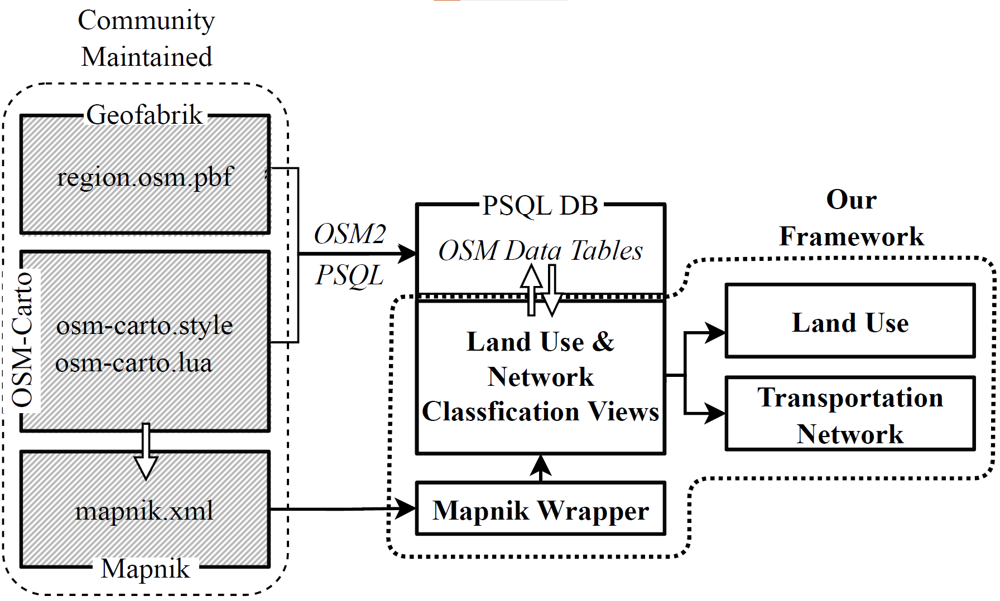

# Spatial Mobility Metrics

This repository is created in addition to the publication "Enhancing Transportation Insights: A Scalable OpenStreetMap Harmonization and Synthesis Framework", released at ITSC 2024, Edmonton Canada. The repository covers read/write, discretization and fusion features for geospatial data. One main contribution involves a land-use extraction module based on the mapnik configuration, that allows to derive land-use data from osm data. The framework is structured as following:



## Getting started

For default setup pyyaml is required, then:
```shell
pip install .
```
## Tutorials
You can find example Jupyter notebooks in the "examples" folder. These should help to get familiar with the main functions.

## Development

1. Setup the python project by installing the required packages via the requirements.yaml with conda or mamba in a prefered venv:
```shell
mamba env create  -f  requirements.yaml
```

2. Secondly open the **smm** folder in vs-code and make sure to have the following extension installed:


```txt
Name: Command Variable
Id: rioj7.command-variable
Description: Calculate command variables for launch.json and tasks.json
Version: 1.61.2
Publisher: rioj7
VS Marketplace Link: https://marketplace.visualstudio.com/items?itemName=rioj7.command-variable
```

3. Debug your modules with the **Python: Aktuelle Datei(Module)** setting. It should be directly executable